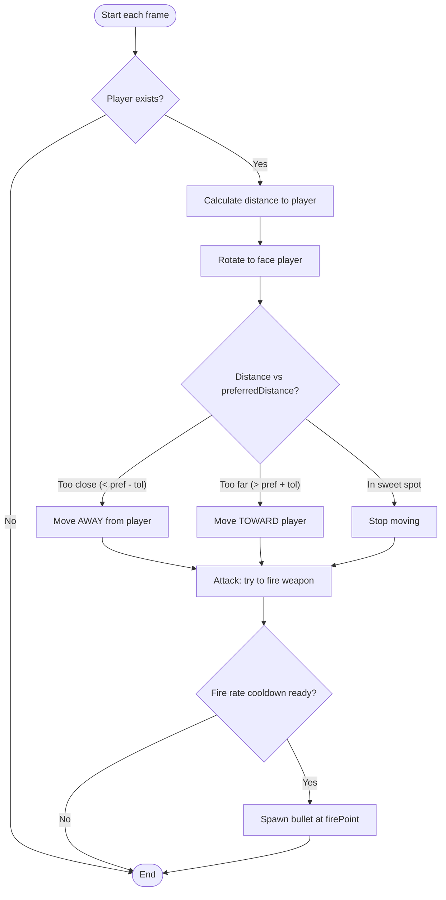
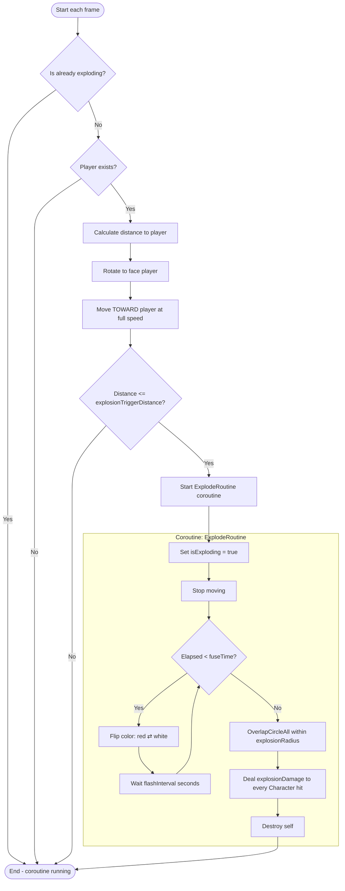
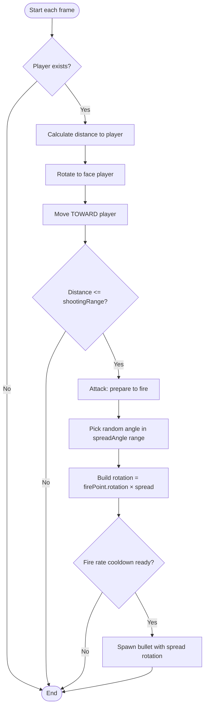
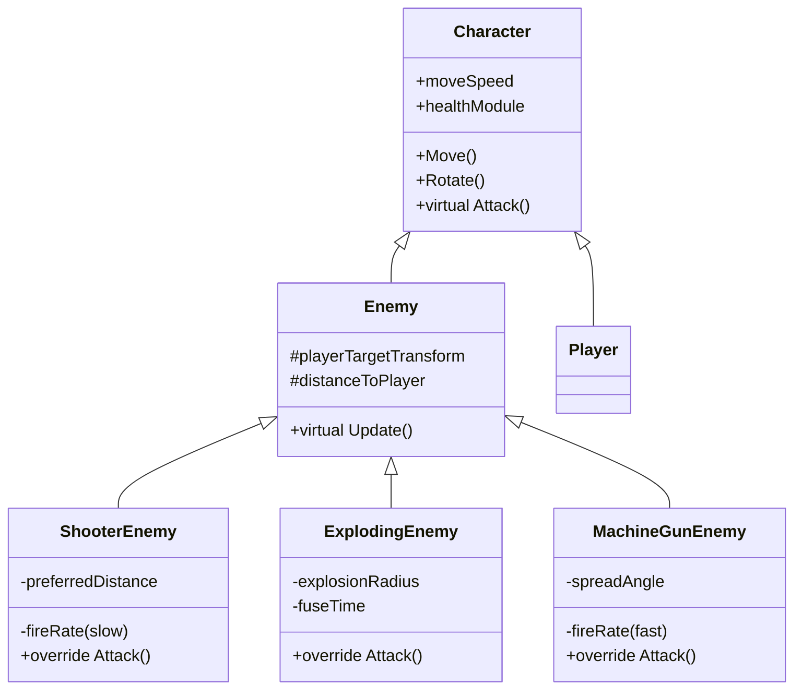

# Enemy Activity Diagrams
**2D Shooter — Assignment 1 Deliverable**
Author: Dillon Madson

---

## 1. Shooter Enemy

The Shooter Enemy keeps a preferred distance from the player and fires slow, accurate bullets (1 shot per 3 seconds).

---

## 2. Exploding Enemy

The Exploding Enemy charges at the player and detonates when in close range, dealing heavy area damage.

---

## 3. Machine Gun Enemy

The Machine Gun Enemy chases the player and sprays bullets at high rate with random spread (low accuracy).

---

## Inheritance Hierarchy

All three enemy types inherit from a shared `Enemy` base class, which itself inherits from `Character`. This is the OOP pattern Assignment 1 demonstrates:

