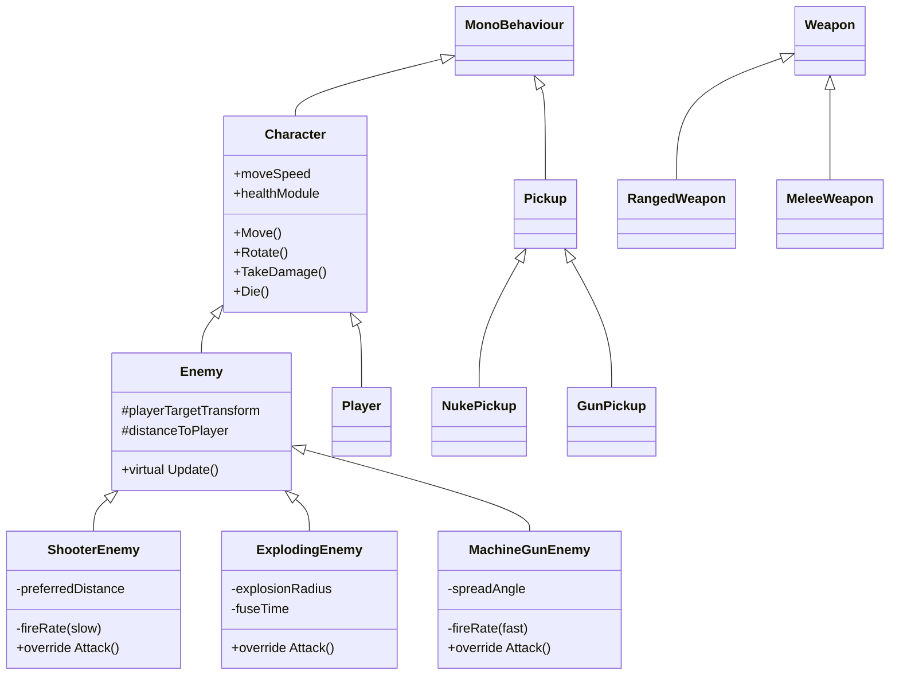

# Shape Wars — Study Guide

**Game 4: Top-Down Shooter — Complete Reference**
*Author: Dillon Madson*

---

## Table of Contents

1. [Project Overview](#project-overview)
2. [Class Hierarchy](#class-hierarchy)
3. [Part 1 — Character.cs](#part-1--charactercs)
4. [Part 2 — Enemy.cs](#part-2--enemycs)
5. [Part 3 — ShooterEnemy.cs](#part-3--shooterenemycs)
6. [Part 4 — ExplodingEnemy.cs](#part-4--explodingenemycs)
7. [Part 5 — MachineGunEnemy.cs](#part-5--machinegunenemycs)
8. [Other Systems (Brief Overview)](#other-systems-brief-overview)
9. [Polish Features](#polish-features)
10. [Master Concept Index](#master-concept-index)
11. [Quick Reference Cards](#quick-reference-cards)

---

# Project Overview

**Shape Wars** is a 2D top-down arcade shooter with neon aesthetics. The player controls a green circle that shoots capsule-shaped bullets at three different enemy types. Enemies spawn from screen edges with increasing difficulty over time.

## Folder Structure

```
Assets/Scripts/
├── Characters/   (Character, Player, IDash, Health)
├── Enemies/      (Enemy, ShooterEnemy, ExplodingEnemy, MachineGunEnemy)
├── Weapons/      (Weapon, RangedWeapon, MeleeWeapon, Bullet)
├── Pickups/      (Pickup, NukePickup, GunPickup, PickupSpawner)
├── Managers/     (Game, Score, UI, GameOver, MainMenu, Pause, Sound)
└── VFX/          (Particles, ScorePopup, Starfield, Camera, HitStop)
```

---

# Class Hierarchy



---

# Part 1 — Character.cs

The **abstract base class** that every living thing inherits from.

## Key Code

```csharp
public abstract class Character : MonoBehaviour
{
    protected Vector2 movementDirection;
    protected bool isDead;
    public bool IsDead => isDead;

    [SerializeField] protected float moveSpeed;
    [SerializeField] protected Rigidbody2D RigidbodyModule;
    [SerializeField] protected float maxHealth = 100f;
    public Health healthModule;

    public virtual void Start()
    {
        if (RigidbodyModule == null) RigidbodyModule = GetComponent<Rigidbody2D>();
        healthModule = new Health(maxHealth);
    }

    public void Move() {
        RigidbodyModule.linearVelocity = movementDirection * moveSpeed;
    }

    public void Rotate(Vector3 directionToRotate) {
        transform.up = directionToRotate - transform.position;
    }

    public virtual void Attack() { }

    public virtual void TakeDamage(float amount) { /* ...handles damage + flash + die */ }

    public virtual void Die() {
        if (isDead) return;
        isDead = true;
        Destroy(gameObject);
    }
}
```

## Concepts Demonstrated

| Concept | Where in code |
|---|---|
| **Abstract class** | `public abstract class Character` |
| **Inheritance** | `Character : MonoBehaviour` |
| **Access modifiers** | `protected`, `public`, `private` |
| **Virtual methods** | `Start()`, `Attack()`, `Die()` — overridable by children |
| **Properties (read-only)** | `IsDead => isDead` |
| **`[SerializeField]`** | Show private field in Inspector |
| **`GetComponent<T>()`** | Find component on same GameObject |
| **Setting velocity directly** | Crisp jitter-free movement |

---

# Part 2 — Enemy.cs

Base for all 3 enemy types. Adds chase logic + death events on top of Character.

## Key Code

```csharp
public class Enemy : Character
{
    public static System.Action<Vector3> OnEnemyDied;
    public static System.Action<Vector3, Color> OnEnemyDiedWithColor;

    protected Transform playerTargetTransform;
    protected float distanceToPlayer;
    [SerializeField] protected int scoreValue = 10;
    [SerializeField] protected Color deathParticleColor = Color.white;

    public override void Start()
    {
        base.Start();
        Player player = FindAnyObjectByType<Player>();
        if (player != null) playerTargetTransform = player.transform;
    }

    public virtual void Update() {
        if (playerTargetTransform == null) return;
        Player player = playerTargetTransform.GetComponent<Player>();
        if (player != null && player.IsDead) return;

        distanceToPlayer = Vector2.Distance(transform.position, playerTargetTransform.position);
        movementDirection = (playerTargetTransform.position - transform.position).normalized;
        Rotate(playerTargetTransform.position);
        Move();
    }

    public override void Die() {
        if (isDead) return;
        ScoreManager.AddScore(scoreValue);
        OnEnemyDied?.Invoke(transform.position);
        OnEnemyDiedWithColor?.Invoke(transform.position, deathParticleColor);
        if (SoundManager.Instance != null) SoundManager.Instance.PlayEnemyDeath();
        base.Die();
    }
}
```

## Concepts Demonstrated

| Concept | What it is |
|---|---|
| **Multi-level inheritance** | `Enemy : Character` (which itself inherits from MonoBehaviour) |
| **`static` fields** | Class-level data shared by all instances |
| **`System.Action<T>`** | Delegate type for events |
| **Event-driven architecture** | Broadcasters + listeners, decoupled |
| **`override`** | Replace a virtual method from parent |
| **`base.Start()` / `base.Die()`** | Call the parent's version inside an override |
| **Early-out guards** | `if (...) return;` to skip rest of method |
| **`Vector2.Distance`** | Distance between two points |
| **`.normalized`** | Make a vector length 1 (direction only) |
| **Null-conditional `?.Invoke()`** | Safely call a method only if not null |

---

# Part 3 — ShooterEnemy.cs

The cautious sniper. Maintains preferred distance, fires slow accurate shots.

## Key Code

```csharp
public class ShooterEnemy : Enemy
{
    [SerializeField] private float preferredDistance = 6f;
    [SerializeField] private float distanceTolerance = 0.5f;
    [SerializeField] private GameObject bulletPrefab;
    [SerializeField] private Transform firePoint;
    [SerializeField] private float fireRate = 0.33f;  // 1 shot / 3 seconds
    [SerializeField] private float bulletDamage = 15f;
    private RangedWeapon weapon;

    public override void Start() {
        base.Start();
        weapon = new RangedWeapon(fireRate, bulletDamage, bulletPrefab);
    }

    public override void Update() {
        if (playerTargetTransform == null) return;
        distanceToPlayer = Vector2.Distance(transform.position, playerTargetTransform.position);
        Rotate(playerTargetTransform.position);

        if (distanceToPlayer < preferredDistance - distanceTolerance) {
            movementDirection = (transform.position - playerTargetTransform.position).normalized; // back away
            Move();
        } else if (distanceToPlayer > preferredDistance + distanceTolerance) {
            movementDirection = (playerTargetTransform.position - transform.position).normalized; // close in
            Move();
        } else {
            movementDirection = Vector2.zero; // stop in sweet spot
        }

        Attack();
    }

    public override void Attack() {
        weapon.Use(firePoint.position, firePoint.rotation, this);
    }
}
```

## Concepts Demonstrated

| Concept | What it is |
|---|---|
| **Multi-level inheritance** | `ShooterEnemy → Enemy → Character` |
| **`[Header("...")]` attribute** | Adds visual sections in the Inspector |
| **Fire rate math** | `1/fireRate` = seconds between shots |
| **Constructor call `new ClassName(...)`** | Instantiates a plain C# class |
| **Skipping `base.Update()`** | Override without calling parent for new behavior |
| **Simple state machine** | `if/else if/else` for AI states |
| **Vector subtraction = direction** | `A - B` = vector from B to A |
| **`this` keyword** | The current instance of the class |

---

# Part 4 — ExplodingEnemy.cs

Suicide bomber. Charges, flashes, then detonates with area damage.

## Key Code

```csharp
public class ExplodingEnemy : Enemy
{
    [SerializeField] private float explosionTriggerDistance = 1.5f;
    [SerializeField] private float explosionRadius = 2.5f;
    [SerializeField] private float explosionDamage = 40f;
    [SerializeField] private float fuseTime = 0.6f;
    [SerializeField] private SpriteRenderer bodyRenderer;
    [SerializeField] private Color flashColor = Color.white;
    [SerializeField] private float flashInterval = 0.08f;
    private bool isExploding;

    public override void Update() {
        if (playerTargetTransform == null || isExploding) return;
        distanceToPlayer = Vector2.Distance(transform.position, playerTargetTransform.position);
        Rotate(playerTargetTransform.position);
        movementDirection = (playerTargetTransform.position - transform.position).normalized;
        Move();
        if (distanceToPlayer <= explosionTriggerDistance) StartCoroutine(ExplodeRoutine());
    }

    private IEnumerator ExplodeRoutine() {
        isExploding = true;
        movementDirection = Vector2.zero;
        Color originalColor = bodyRenderer.color;

        // Flashing fuse
        float elapsed = 0f;
        bool isWhite = false;
        while (elapsed < fuseTime) {
            bodyRenderer.color = isWhite ? originalColor : flashColor;
            isWhite = !isWhite;
            yield return new WaitForSeconds(flashInterval);
            elapsed += flashInterval;
        }

        // BOOM
        if (SoundManager.Instance != null) SoundManager.Instance.PlayExplosion();
        if (CameraShake.Instance != null) CameraShake.Instance.Shake(0.4f, 0.4f);
        if (HitStop.Instance != null) HitStop.Instance.Freeze(0.08f);

        Collider2D[] hits = Physics2D.OverlapCircleAll(transform.position, explosionRadius);
        foreach (Collider2D hit in hits) {
            Character victim = hit.GetComponentInParent<Character>();
            if (victim != null && victim != this) victim.TakeDamage(explosionDamage);
        }
        Destroy(gameObject);
    }

    void OnDrawGizmosSelected() {
        Gizmos.color = new Color(1f, 0.4f, 0f, 0.4f);
        Gizmos.DrawWireSphere(transform.position, explosionRadius);
    }
}
```

## Concepts Demonstrated

| Concept | What it is |
|---|---|
| **`using` directive** | Import a namespace's classes |
| **Logical OR `||`** | "Either condition is true" |
| **`StartCoroutine()`** | Launch a method that can pause/resume |
| **`IEnumerator`** | Coroutine return type |
| **`yield return new WaitForSeconds(t)`** | Pause coroutine for t seconds |
| **Ternary operator `? :`** | Shorthand if/else expression |
| **Toggle pattern `x = !x`** | Flip a bool value |
| **Singleton pattern (`.Instance`)** | Global access to one instance |
| **`Physics2D.OverlapCircleAll`** | AOE collision detection |
| **`foreach`** | Iterate every item in a collection |
| **`GetComponentInParent<T>()`** | Find component on GameObject or any ancestor |
| **`OnDrawGizmosSelected()`** | Editor-only debug visualization |

---

# Part 5 — MachineGunEnemy.cs

Spray-and-pray enemy. Chases the player and fires fast inaccurate shots.

## Key Code

```csharp
public class MachineGunEnemy : Enemy
{
    [SerializeField] private float shootingRange = 8f;
    [SerializeField] private GameObject bulletPrefab;
    [SerializeField] private Transform firePoint;
    [SerializeField] private float fireRate = 5f;     // 5 bullets/sec
    [SerializeField] private float bulletDamage = 5f;
    [SerializeField] private float spreadAngle = 15f; // ±15° random spread
    private RangedWeapon weapon;

    public override void Start() {
        base.Start();
        weapon = new RangedWeapon(fireRate, bulletDamage, bulletPrefab);
    }

    public override void Update() {
        if (playerTargetTransform == null) return;
        distanceToPlayer = Vector2.Distance(transform.position, playerTargetTransform.position);
        Rotate(playerTargetTransform.position);
        movementDirection = (playerTargetTransform.position - transform.position).normalized;
        Move();
        if (distanceToPlayer <= shootingRange) Attack();
    }

    public override void Attack() {
        if (weapon == null || firePoint == null) return;
        float randomSpread = Random.Range(-spreadAngle, spreadAngle);
        Quaternion spreadRotation = firePoint.rotation * Quaternion.Euler(0, 0, randomSpread);
        weapon.Use(firePoint.position, spreadRotation, this);
    }
}
```

## Concepts Demonstrated

| Concept | What it is |
|---|---|
| **`Random.Range(min, max)` (float)** | Random float between min and max (both inclusive) |
| **`Random.Range(min, max)` (int)** | Random int from min to max-1 (max EXCLUSIVE!) |
| **`Quaternion`** | Unity's 3D rotation type |
| **`Quaternion.Euler(x, y, z)`** | Build a Quaternion from degree values |
| **2D rotation = Z axis** | Because camera looks down Z |
| **Rotation multiplication `A * B`** | Combine two rotations into one |
| **DPS tradeoff design** | High rate × low damage vs. low rate × high damage |
| **Range gating** | Only fire when within shooting range |

---

# Other Systems (Brief Overview)

We also built these systems — covered briefly here. Same patterns recur (inheritance, events, singletons, coroutines).

## Player.cs (Characters/)

- Inherits `Character`, implements `IDash` interface
- Reads input (WASD + mouse) in `Update()`
- Applies physics (`Move()`) in `FixedUpdate()` (for jitter-free motion)
- Holds nuke count, gun power-up timer, dash cooldown
- Fires `OnPlayerDied` event when killed
- Override `Die()` so player isn't destroyed (game over screen takes over)
- Override `TakeDamage()` to also flash the screen red

## Health.cs (Characters/)

- Plain C# class (NOT a MonoBehaviour)
- Tracks `healthpoints` field
- `IncreaseHealth(amount)` / `DecreaseHealth(amount)` methods
- `IsDead => healthpoints <= 0` property

## Bullet.cs (Weapons/)

- Sets velocity in `Start()` based on `transform.up`
- `OnCollisionEnter2D` damages any Character it hits
- Tracks `owner` so it doesn't damage the shooter
- Auto-adds a `TrailRenderer` for the glowing trail

## RangedWeapon.cs (Weapons/)

- Plain C# class (NOT a MonoBehaviour)
- Holds bullet prefab + fire rate cooldown
- `Use(position, rotation, owner)` method spawns a bullet if cooldown is up
- Inherits from abstract `Weapon` base class

## Pickup.cs (Pickups/)

- Abstract base class for pickups
- Self-rotates and bobs (from polish round 2)
- Auto-destroys after `lifetime` seconds
- `OnTriggerEnter2D` calls `OnPickedUp(player)` (abstract method)
- Subclasses `NukePickup` and `GunPickup` implement the unique effects

## PickupSpawner.cs (Pickups/)

- Listens for `Enemy.OnEnemyDied` event
- Rolls `dropChance` to decide if a pickup spawns
- Picks a random prefab from a list
- Same pattern as `DeathParticleSpawner`

## GameManager.cs (Managers/)

- Spawns enemies on a timer from random screen edges
- Difficulty scales over time (using `Mathf.Lerp` between start/end values)
- Uses `Camera.main.orthographicSize` to find screen edges
- Caps at `maxEnemiesAliveCap` to prevent chaos

## ScoreManager.cs (Managers/)

- Singleton with static `Score` field
- Updates a TextMeshPro UI element every frame
- Reset to 0 in `Awake()`

## UIManager.cs (Managers/)

- Updates HP, Score, Nukes, Wave, Dash bar each frame
- Floating gun timer follows player by converting world → screen position via `mainCamera.WorldToScreenPoint()`

## GameOverManager.cs (Managers/)

- Subscribes to `Player.OnPlayerDied`
- Saves high score using `PlayerPrefs.GetInt/SetInt`
- Sets `Time.timeScale = 0` to pause the world
- `RestartGame()` reloads the scene with `SceneManager.LoadScene`

## MainMenuManager.cs (Managers/)

- Has methods bound to UI buttons: `PlayGame()`, `ShowInstructions()`, `QuitGame()`
- Uses `SceneManager.LoadScene` to start the game

## PauseManager.cs (Managers/)

- Listens for Esc key, toggles `Time.timeScale` between 0 and 1
- Shows/hides the pause panel
- Same SceneManager pattern as the others

## SoundManager.cs (Managers/)

- Singleton
- Generates SFX procedurally using sample arrays + `AudioClip.Create()`
- Wave types: Sine / Square / Triangle / Sawtooth
- Builds music procedurally too — chord progression with arpeggios

## BurstParticle.cs (VFX/)

- Configures a Unity ParticleSystem at runtime (loop, duration, speed, color)
- Sets `stopAction = Destroy` for auto-cleanup
- `SetColor()` lets external code tint the burst per enemy

## DeathParticleSpawner.cs (VFX/)

- Listens for `Enemy.OnEnemyDiedWithColor`
- Spawns a `BurstParticle` prefab at the death position
- Calls `SetColor()` so each enemy type has its own burst color

## CameraFollow.cs (VFX/)

- In `LateUpdate()`, snaps camera to `target.position + offset`
- Adds shake offset from `CameraShake.Instance.GetCurrentOffset()`

## CameraShake.cs (VFX/)

- Singleton
- `Shake(intensity, duration)` runs a coroutine that sets random offsets
- Uses `Random.insideUnitCircle` for offset directions

## HitStop.cs (VFX/)

- Singleton
- `Freeze(duration)` sets `Time.timeScale = 0` then back to 1 after duration
- Uses `WaitForSecondsRealtime` (not affected by timeScale)

## ScorePopup.cs (VFX/)

- World-space TextMeshPro that floats up and fades out
- Lerps alpha from 1 → 0 over its lifetime
- Self-destroys when done

## Starfield.cs (VFX/)

- Generates ~600 small star sprites at random positions
- Creates the star sprite procedurally using `Texture2D.SetPixels()` + `Sprite.Create()`
- Mixes white and bluish stars for variety

---

# Polish Features

| Feature | What it does | Where the code lives |
|---|---|---|
| **Hit flash** | Enemies flash white when damaged | `Character.TakeDamage()` + `FlashOnHit()` coroutine |
| **Camera shake** | Camera vibrates on explosions | `CameraShake.cs` + `CameraFollow.cs` |
| **Damage flash** | Red screen overlay when player takes damage | `Player.TakeDamage()` override |
| **Score popups** | "+10" floats up from corpses | `ScorePopup.cs` + `Enemy.Die()` |
| **Pause menu** | Esc to pause the world | `PauseManager.cs` |
| **Background music** | Procedural cosmic ambient | `SoundManager.MakeAmbientLoop()` |
| **Bullet trails** | Bullets leave a glowing trail | Auto-added in `Bullet.Start()` |
| **Bobbing pickups** | Pickups gently bob up/down | `Pickup.Update()` with `Mathf.Sin` |
| **Dash cooldown** | Visible cooldown bar fills | `Player.dashEndTime` + `UIManager` |
| **Hit-stop** | 80ms time freeze on explosions | `HitStop.cs` singleton |
| **Wave indicator** | UI shows "Wave 1 | 5s" | `GameManager.DifficultyPercent` + `UIManager` |
| **Starfield** | Procedural stars in background | `Starfield.cs` |
| **Bloom** | Neon glow post-processing | URP Volume Profile (no script) |
| **Difficulty scaling** | Spawn rate accelerates over 90s | `GameManager.Update()` with `Mathf.Lerp` |

---

# Master Concept Index

A complete reference of every concept demonstrated in this project, grouped by topic.

## OOP (Object-Oriented Programming)

| Concept | Definition |
|---|---|
| **Class** | A blueprint for objects |
| **Object / Instance** | A specific copy of a class created at runtime |
| **Inheritance** | A child class gets all of the parent's features automatically |
| **Multi-level inheritance** | A → B → C chain |
| **Abstract class** | Can't be instantiated directly; meant only as a parent |
| **Abstract method** | No body; children MUST override it |
| **Virtual method** | Has a default body; children CAN override it |
| **Override** | Replace a virtual method in a child class |
| **`base.Method()`** | Call the parent's version of an overridden method |
| **`this`** | The current instance |
| **Encapsulation** | Hiding internal data behind a public interface |
| **Polymorphism** | Treating different child types through a common parent reference |

## Access Modifiers

| Modifier | Who can use it |
|---|---|
| **`public`** | Anyone |
| **`private`** | Only this class |
| **`protected`** | This class + child classes |
| **`internal`** | Anyone in the same assembly (rarely used in Unity) |

## Unity-Specific

| Concept | What it is |
|---|---|
| **MonoBehaviour** | Base class for scripts that live on GameObjects |
| **`Start()`** | Runs once when GameObject becomes active |
| **`Update()`** | Runs every frame |
| **`FixedUpdate()`** | Runs on physics tick (50Hz default); use for Rigidbody code |
| **`LateUpdate()`** | Runs after all Updates; ideal for camera follow |
| **`Awake()`** | Runs even before Start; used for self-init |
| **`OnEnable()` / `OnDisable()`** | Subscribe/unsubscribe to events |
| **`OnTriggerEnter2D()`** | Called when something enters this trigger collider |
| **`OnCollisionEnter2D()`** | Called on physical collision |
| **`OnDrawGizmosSelected()`** | Editor-only debug visualization |
| **`[SerializeField]`** | Show private field in Inspector |
| **`[Header("...")]`** | Add a labeled section in Inspector |
| **`[Range(min, max)]`** | Add a slider in Inspector |
| **`Instantiate(prefab, pos, rot)`** | Spawn a copy of a prefab |
| **`Destroy(gameObject)`** | Remove from scene |
| **`Destroy(gameObject, time)`** | Remove after delay |
| **`GetComponent<T>()`** | Find component on the same GameObject |
| **`GetComponentInParent<T>()`** | Find component on this or any ancestor |
| **`GetComponentsInChildren<T>()`** | Find all components on this and descendants |
| **`FindAnyObjectByType<T>()`** | Scene-wide search for a component |
| **`FindObjectsByType<T>()`** | Find all instances of a type in scene |

## Math

| Concept | Use |
|---|---|
| **`Vector2.Distance(a, b)`** | Distance between two points |
| **`vector.normalized`** | Make a vector length 1 (direction only) |
| **`A - B` (vectors)** | Vector from B to A |
| **`A * scalar`** | Scale a vector |
| **`Mathf.Lerp(a, b, t)`** | Blend a and b by percentage t (0..1) |
| **`Mathf.Clamp01(x)`** | Force a value into [0, 1] |
| **`Mathf.Sin(angle)`** | Smooth oscillation between -1 and 1 |
| **`Mathf.RoundToInt(f)`** | Float to nearest integer |
| **`Random.Range(min, max)`** | Random float (or int — ints are exclusive) |
| **`Random.value`** | Random float [0, 1] |
| **`Random.insideUnitCircle`** | Random Vector2 inside a unit circle |
| **`Quaternion.Euler(x, y, z)`** | Build a rotation from degree values |
| **Quaternion `A * B`** | Combine two rotations |

## Coroutines & Time

| Concept | What it is |
|---|---|
| **`IEnumerator`** | Coroutine return type |
| **`StartCoroutine(method)`** | Launch a coroutine |
| **`StopCoroutine(reference)`** | Stop a specific coroutine |
| **`StopAllCoroutines()`** | Stop every coroutine on this script |
| **`yield return null`** | Wait one frame |
| **`yield return new WaitForSeconds(t)`** | Wait t seconds (affected by `Time.timeScale`) |
| **`yield return new WaitForSecondsRealtime(t)`** | Wait t seconds (ignores `Time.timeScale`) |
| **`yield break`** | Exit the coroutine early |
| **`Time.deltaTime`** | Seconds since last frame |
| **`Time.fixedDeltaTime`** | Seconds per physics tick |
| **`Time.time`** | Total seconds since game started |
| **`Time.timeScale = 0`** | Pause the world |

## Events & Patterns

| Concept | What it is |
|---|---|
| **`System.Action`** | Delegate type — "method that takes params, returns void" |
| **`OnEvent?.Invoke(args)`** | Safely fire an event if anyone subscribed |
| **Subscribe with `+=`** | `Enemy.OnEnemyDied += MyMethod;` |
| **Unsubscribe with `-=`** | `Enemy.OnEnemyDied -= MyMethod;` |
| **Singleton pattern** | One global instance accessible via `.Instance` |
| **State machine** | `if/else` branches for different AI states |
| **Object pool (advanced)** | Reuse objects instead of Instantiate/Destroy (not used here, but a future skill) |

## C# Syntax

| Concept | Example |
|---|---|
| **Ternary `? :`** | `int a = b ? 1 : 2;` |
| **Logical AND `&&`** | `if (a && b)` |
| **Logical OR `||`** | `if (a || b)` |
| **Logical NOT `!`** | `if (!a)` |
| **Toggle `x = !x`** | Flip a bool |
| **Null-conditional `?.`** | `obj?.Method()` only calls if obj is not null |
| **Expression-bodied property** | `public bool IsDead => isDead;` |
| **`foreach`** | `foreach (var item in collection) { ... }` |
| **`switch`** | Multi-branch decision based on a value |

## Physics & Rendering

| Concept | What it is |
|---|---|
| **`Rigidbody2D.linearVelocity`** | Set velocity directly (smooth movement) |
| **`Rigidbody2D.AddForce()`** | Apply a push (subject to drag) |
| **Rigidbody2D Interpolation** | Smooths visuals between physics ticks |
| **`Collider2D` is Trigger** | Detects overlap without physical collision |
| **`Physics2D.OverlapCircleAll(pos, radius)`** | Find all colliders in a circle |
| **`SpriteRenderer.color`** | Tint a sprite |
| **`SpriteRenderer.sortingOrder`** | Render order (higher = in front) |
| **`TrailRenderer`** | Auto-creates a trail behind a moving object |
| **`ParticleSystem`** | Bursts of small visual elements |
| **Bloom (URP post-processing)** | Adds glow to bright pixels |

## UI

| Concept | What it is |
|---|---|
| **Canvas** | Container for UI elements |
| **CanvasScaler** | Scales UI to screen size |
| **Anchor preset (Alt+click)** | Set anchor + position in one click |
| **TextMeshProUGUI** | UI-space text |
| **TextMeshPro (3D)** | World-space text (used for score popup) |
| **`Image.fillAmount`** | Percentage filled (for progress bars) |
| **Button.onClick** | Hook code to a button press |
| **`Camera.WorldToScreenPoint(worldPos)`** | Convert world → screen |

## Persistence

| Concept | What it is |
|---|---|
| **`PlayerPrefs.SetInt(key, value)`** | Save an int |
| **`PlayerPrefs.GetInt(key, default)`** | Load an int |
| **`PlayerPrefs.Save()`** | Force save to disk |
| **`SceneManager.LoadScene(name)`** | Load a scene |
| **`Time.timeScale = 1f`** | Always reset before loading scenes |

---

# Quick Reference Cards

## Card 1 — How Inheritance Works

```csharp
// Parent
public abstract class Character : MonoBehaviour {
    public virtual void Die() { Destroy(gameObject); }
}

// Child (inherits everything from Character)
public class Enemy : Character {
    public override void Die() {
        ScoreManager.AddScore(10);
        base.Die(); // Run parent's logic too
    }
}

// Grandchild (inherits everything from Enemy AND Character)
public class ShooterEnemy : Enemy { /* ... */ }
```

## Card 2 — How Events Work

```csharp
// Define
public class Enemy : Character {
    public static System.Action<Vector3> OnEnemyDied;
}

// Fire (the broadcaster doesn't know who's listening)
OnEnemyDied?.Invoke(transform.position);

// Subscribe (the listener)
public class PickupSpawner : MonoBehaviour {
    void OnEnable()  { Enemy.OnEnemyDied += HandleDeath; }
    void OnDisable() { Enemy.OnEnemyDied -= HandleDeath; } // ALWAYS unsubscribe
    void HandleDeath(Vector3 pos) { /* ... */ }
}
```

## Card 3 — How Coroutines Work

```csharp
using System.Collections;

void Start() {
    StartCoroutine(MyTimer());
}

IEnumerator MyTimer() {
    Debug.Log("Step 1");
    yield return new WaitForSeconds(1f); // pause for 1 sec
    Debug.Log("Step 2");
    yield return new WaitForSeconds(1f);
    Debug.Log("Step 3 - done!");
}
```

## Card 4 — How Singletons Work

```csharp
public class SoundManager : MonoBehaviour {
    public static SoundManager Instance { get; private set; }

    void Awake() {
        if (Instance != null && Instance != this) {
            Destroy(gameObject);
            return;
        }
        Instance = this;
    }

    public void PlayShoot() { /* ... */ }
}

// From any other script:
SoundManager.Instance.PlayShoot();
```

## Card 5 — Update vs FixedUpdate vs LateUpdate

```csharp
void Update() {
    // Every frame (60+ Hz, variable timing)
    // Use for: input, animations, anything visual
    if (Input.GetKeyDown(KeyCode.Space)) Dash();
}

void FixedUpdate() {
    // Every physics step (50 Hz default, fixed timing)
    // Use for: ALL Rigidbody / physics code
    rb.linearVelocity = movementDirection * moveSpeed;
}

void LateUpdate() {
    // After all Updates have run
    // Use for: camera follow, IK, late-frame adjustments
    transform.position = target.position + offset;
}
```

## Card 6 — Vector Direction Math

```csharp
// Vector from A to B
Vector2 direction = b - a;

// Normalized direction (length 1)
direction = direction.normalized;

// Distance
float dist = Vector2.Distance(a, b);

// Move toward player
movementDirection = (player.position - transform.position).normalized;

// Move AWAY from player
movementDirection = (transform.position - player.position).normalized;
```

---

# How to Convert This to PDF

Three easy options:

**Option A — VS Code "Markdown PDF" extension** (recommended)
1. Install extension: search "Markdown PDF" by yzane
2. Open this file in VS Code
3. Right-click → **Markdown PDF: Export (pdf)**

**Option B — HackMD.io** (browser, no install)
1. Go to https://hackmd.io → Guest mode
2. Paste this markdown
3. Click "..." → Export → PDF

**Option C — Pandoc** (command line)
```
pandoc StudyGuide.md -o StudyGuide.pdf
```

---

*End of Study Guide. Total concepts covered: 100+. Total scripts: 25+. Total OOP wins: 🎓*
